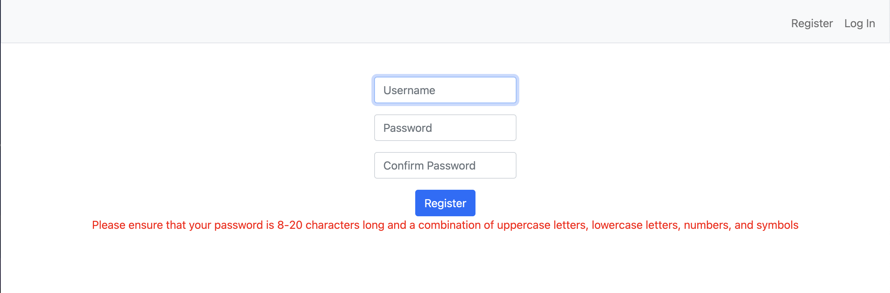
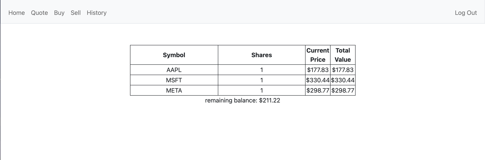
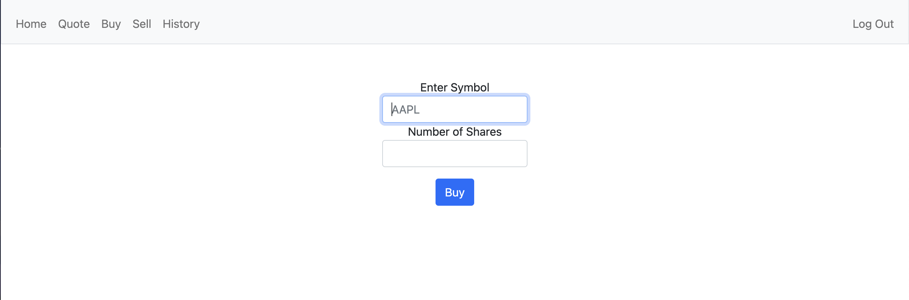
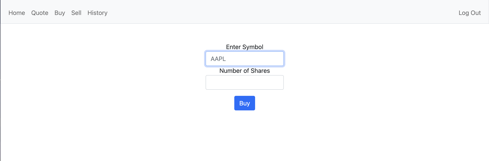
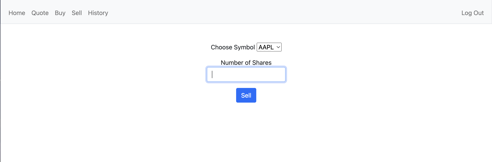
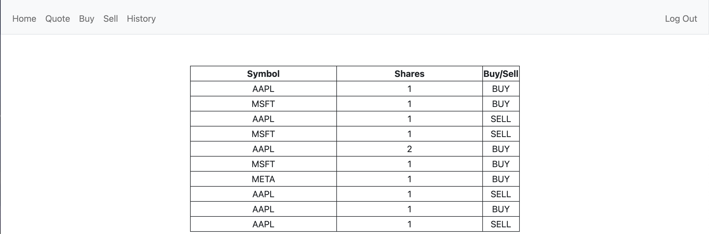

# Stock Trading Site

This is a simple web application, that allows users to buy and sell stocks.

## Table of Contents

- [Introduction](#introduction)
- [Features](#features)
- [Prerequisites](#prerequisites)
- [Usage](#usage)
  - [Register](#register)
  - [Log In](#log-in)
  - [Quote](#quote)
  - [Buy](#buy)
  - [Sell](#sell)

## Introduction

This project was created for the EDX CS50 Course. The aim was to build a simple platform that allows users to buy and sell stocks.

The application uses the yahoo fincance API to retrieve the prices of the stocks. All data pertaining to the user's transactions is stored on the sqlite db, Flask-SQL alchemy is utilised to link the database with the application.

## Features

- Account creation via a registration Form
- Basic Authentication
- Retrieve quote for a given stock
- Buy and sell stocks
- View your portfolio and transaction history

## Prerequisites

- Flask
- Flask-Session
- Flask-SQLALchemy
- Flask-Migrate
- yfinance

## Usage

### Register

Users can use this page to create their accounts, a unique username must be provided along with a password that meets the requirements.

The request will fail with an error message returned in the following scenarios

- Username is not unique
- Password does not meet the requirements
- Provided passwords do not.

If the request is successful, the username and password hash will be added to the database.

### Log In

Users can sign in to the platform with basic authentication.

The code will check the database for a matching user, if the password hash of that user matches the hash of the password that was entered, the user will be signed in.

If authentication is successful, the user's id will be added to the session.

        session["user_id"] = user.id

This is cleared at the beginning of the request to prevent multiple users existing in the session.

    session.clear()

### Home

From the home page, a logged in user can see their current portfolio. This is taken from the portfolio table of the database.

### Quote

This is where users can look up the price of a stock.

If a valid ticker is entered, the current stock price will be returned

The yfinance module is used to get the stock price details:

    symbol = symbol.upper()
    try:
        stock=yfinance.Ticker(urllib.parse.quote_plus(symbol)) 
        price=stock.info['currentPrice']   
        return {"name": symbol, "price": price, "symbol": symbol}
    except:
        return None

### Buy

This is where users can buy shares of a specific stock.

The request will fail in the following scenarios:

- Ticker is not valid.
- The number of shares is not a positive whole number.
- User does not have enough cash in their account.

If the request is successful the shares will be added to the users account

### Sell

This is where users can sell shares of a stock in their portfolio.

The dropdown provides a list of the stocks that the user owns shares of. The number of shares must be specified in the text box, the request will be rejected if the number of shares entered is invalid (i.e greater than the number of shares available or not a positive whole number)

### History

On this page, a user can view their transaction history.

This information is pulled from the transactions table of the database.
